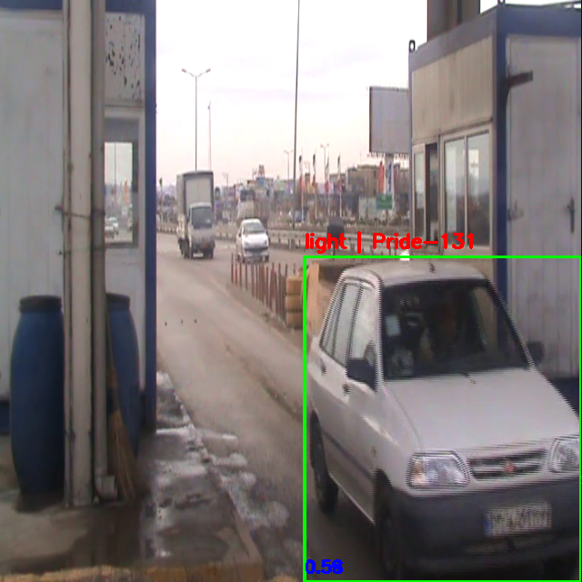
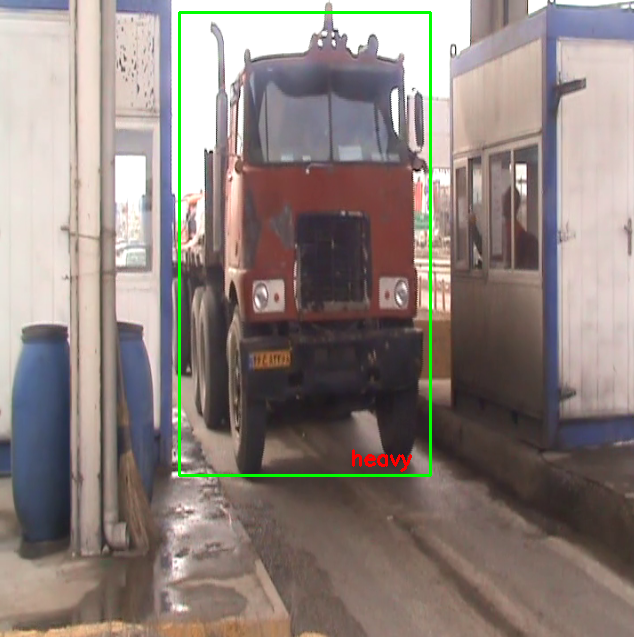

# Vehicle Detection and Classification Pipeline

This project implements a two-stage computer vision pipeline for vehicle analysis in video streams. It combines YOLOv8 for object detection and a ResNet18-based classifier for vehicle type classification.

The system processes video frames, detects vehicles, extracts bounding boxes, and classifies each detected region as either light or heavy.

## Project Structure

```
vehicle-classification/
├── data/
│   ├── dataset_level1/
│   │   ├── train/
│   │   └── val/
│   └── videos/
│       └── M2U00107.mp4
├── models/
│   ├── light_heavy_model.pth
│   └── yolov8n.pt
├── scripts/
│   ├── run_video.py
│   └── train.py
├── src/
│   ├── config.py
│   ├── data/
│   │   └── dataloader.py
│   ├── inference/
│   │   └── video_processor.py
│   ├── models/
│   │   ├── classifier.py
│   │   └── detector.py
│   └── training/
│       └── trainer.py
└── main.py
```

## Models

YOLOv8 is used for vehicle detection. It outputs bounding boxes for objects detected in each frame of the video.

A ResNet18 model is used for classification. It is fine-tuned on a custom dataset to classify vehicles into two classes: light and heavy. Only the final fully connected layer is trained while the rest of the network is frozen.

## Dataset

The dataset follows a standard ImageFolder structure compatible with PyTorch.

```
dataset_level1/
├── train/
│   ├── light/
│   └── heavy/
└── val/
    ├── light/
    └── heavy/
```

Images are resized to 224x224 and normalized using ImageNet statistics.

## Training

Training is executed using scripts/train.py.

The training pipeline:
- Loads dataset using PyTorch DataLoader
- Initializes pretrained ResNet18
- Replaces final classification layer
- Trains only classifier head
- Evaluates on validation set

The trained model is saved in models/light_heavy_model.pth.

## Inference

Run inference using:

```
python main.py --video data/videos/M2U00107.mp4
```

The pipeline:
- Reads video frame by frame
- Runs YOLO detection on each frame
- Extracts detected vehicle regions
- Passes each region to classifier
- Draws bounding boxes and labels on output frames
- Displays real-time annotated video

Press q to exit.

## Requirements

Install dependencies with:

```
pip install -r requirements.txt
```

Main dependencies:
- torch
- torchvision
- opencv-python
- ultralytics
- pillow
- tqdm


## Sample Results

<p align="center">
  
  
</p>
